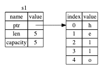
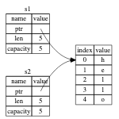

String 는 세 부분으로 구성되며, 왼쪽에 표시된 것은 문자열의 내용을 저장하는 메모리에 대한 포인터, 길이 및 용량입니다. 이 데이터 그룹은 스택에 저장됩니다. 오른쪽은 내용물을 보관하는 힙 위의 메모리입니다.

```rust
fn main() {
    let s = String::from("hello");
    let len = s.len();
    let capacity = s.capacity();
    println!("len: {}, capacity: {}", len, capacity);
}
```



```rust
fn main() {
    let s1 = String::from("hello");
    let s2 = s1;
}
```

s1 로 s2, 그 String 데이터가 복사됩니다. 즉, 포인터, 길이 및 스택에 있는 용량을 복사합니다. 포인터가 참조하는 힙의 데이터를 복사하지 않습니다



Rust는 첫 번째 변수도 무효화하기 때문에 얕은 사본이라고 하는 것이 아니라 이동이라고 합니다. 이동은 Rust에서 무효화가 발생하는 경우입니다.

### Stack-Only Data: Copy

```rust
fn main() {
    let x = 5;
    let y = x;
    println!("x = {}, y = {}", x, y);
}
```

### 소유권 및 기능 
